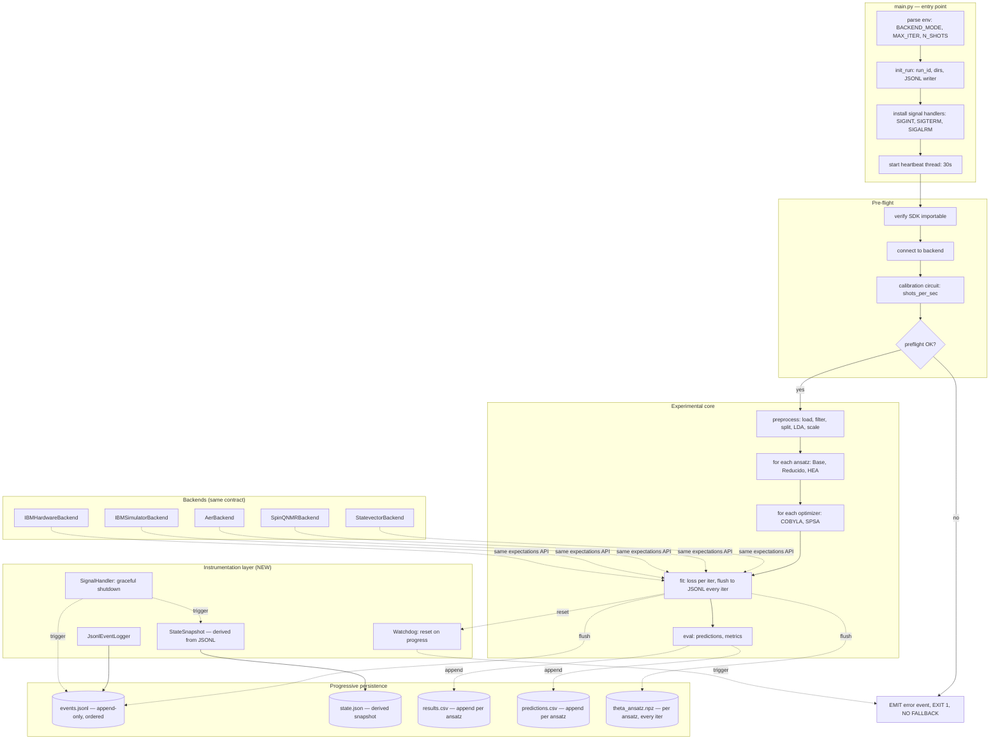

# System Architecture — Instrumented VQC Pipeline

> **Status:** Proposed (DAG-validated, not yet implemented)
> **Owner:** Cristóbal Cheuquel, Valentina Huenchuñir
> **Last update:** 2026-07-05

## Goal

Add progressive persistence, traceability, and graceful shutdown to the existing VQC pipeline at `/home/cris/Workspace/26-1/cuantica/ElectivoCuantica/`. The architecture is backend-agnostic: identical instrumentation for `statevector`, `spinq_nmr`, `aer_simulator`, `ibm_simulator`, `ibm_hardware`.

## High-level component diagram



## Key invariants

- **NO fallback policy.** If preflight fails (SDK missing, backend unreachable, calibration hang), the run emits an error event, writes `state.json` with `status=failed`, and exits 1. Silent degradation to a different backend is forbidden.
- **JSONL is the single source of truth.** `state.json` is a derived snapshot; if it is corrupted, it can be reconstructed from `events.jsonl`.
- **Same schema for every backend.** `statevector`, `spinq_nmr`, `aer_simulator`, `ibm_simulator`, `ibm_hardware` all emit the same event types and the same state.json structure.
- **Per-iteration fsync on simulator, batched (5 iters or 30 s) on hardware.** Trade-off between robustness and throughput.
- **Phase-aware watchdog.** 300 s for simulator, 1800 s for `spinq_nmr`, 3600 s for `ibm_hardware`. Different phases (calibration, training) have different timeout multipliers.
```