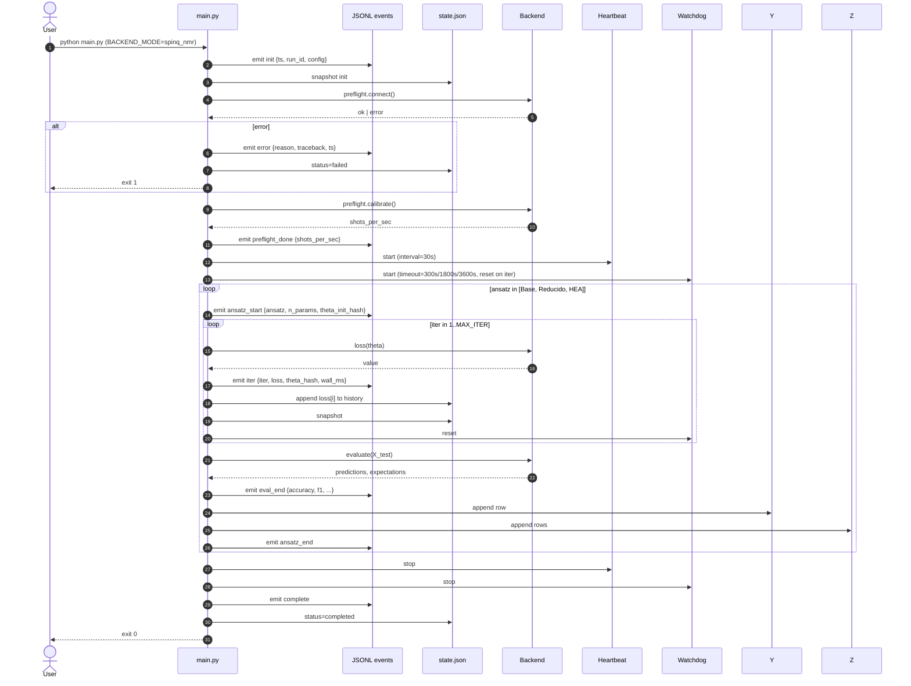

# Run Lifecycle

End-to-end sequence of a single `python main.py` invocation, from process start to exit.



## Phase boundaries (state.json snapshots)

A `state.json` snapshot is written (atomically) at these events:
- `init`
- `preflight_ok`
- `calibration_done`
- `ansatz_end` of each ansatz
- `eval_end` of each ansatz
- `shutdown` (any reason: user interrupt, watchdog, normal exit)

The source of truth is `events.jsonl`. `state.json` is a derived view for cheap reading and resume logic.
```