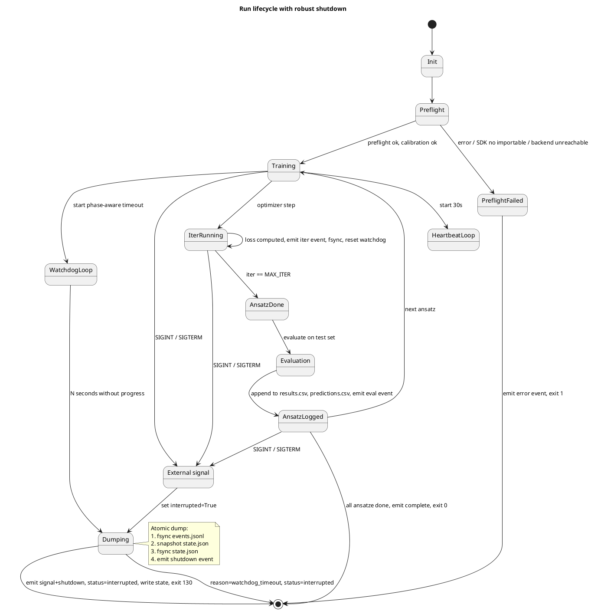

# Signal Handling & Shutdown



## Pattern: O_NONBLOCK self-pipe

Python signal handlers must be async-signal-safe. The only safe operations in a handler are:
- write to an `O_NONBLOCK` pipe (1 byte)
- set an atomic flag (`_thread.interrupt_flag` or `signal.set_wakeup_fd`)

Heavy work (flushing JSONL, writing state.json) is done in the main thread, on the next loop iteration, after the handler returns.

```python
import os, signal, select

_read_fd, _write_fd = os.pipe()
os.set_blocking(_write_fd, False)  # O_NONBLOCK
os.set_blocking(_read_fd, False)

def _handler(signum, frame):
    try:
        os.write(_write_fd, b"\x00")  # 1 byte, ignore EAGAIN
    except BlockingIOError:
        pass  # pipe full, signal already pending

signal.signal(signal.SIGINT, _handler)
signal.signal(signal.SIGTERM, _handler)
```

Main loop uses `select.select([_read_fd], [], [], 0.1)` to detect signal without busy-waiting.

## Double-signal escalation

A second SIGINT within 2 s forces immediate exit (no flush). This is the user's "really kill it" path.
```