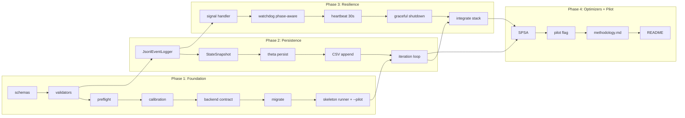

# Task DAG — 4 Phases, 22 Atomic Tasks



## PR boundaries

- **PR #1** (Phase 1): runnable skeleton, no training yet. Validation: `python main.py --backend spinq_nmr` exits 1 with proper error event.
- **PR #2** (Phase 2): training loop survives SIGKILL mid-iter. Validation: stress test with `os.kill(os.getpid(), signal.SIGKILL)` after N iters.
- **PR #3** (Phase 3): signal/watchdog/heartbeat integration. Validation: `os.kill(os.getpid(), signal.SIGINT)` after 2 iters → state shows `status=interrupted`, `current_iter=2`.
- **PR #4** (Phase 4): both optimizers + pilot. Validation: `--pilot` produces run with `MAX_ITER=5, N_SHOTS=64`.

## Commit sequence (22 commits, 4 PRs)

Each task is one commit. PRs bundle commits in their phase.
```